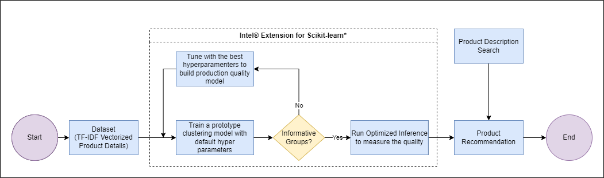

# Product Recommendation System

## Introduction

In this reference kit, we demonstrate one way in which we can use Artificial Intelligence (AI) to design a Product Recommendation System for an e-commerce business.

Check out more workflow examples in the [Developer Catalog](https://developer.intel.com/aireferenceimplementations).

## Solution Technical Overview

When a new customer without any previous purchase history visits the e-commerce website for the first time and a business without any user-item purchase history, a product recommendation system will recommend the products based on the textual clustering analysis on the text given in the product description. Once, the customer makes a purchase, the product recommendation system updates and recommends other products based on the purchase history and ratings provided by other users on the website. Considering the journey of a new customer from the time the customer lands on the e-commerce website for the first time to when it makes repeat purchases, this reference kit can help e-commerce businesses to bring targeted products to customers using textual clustering analysis on the text given in the product description.

This reference kit solution extends to demonstrate the advantages of using the Intel® oneAPI AI Analytics Toolkit on the task of building a product recommendation system from product descriptions via cluster analysis.  The savings gained from using Intel® technologies can lead an analyst to more efficiently explore and understand customer archetypes, leading to better and more precise targeted solutions.

Learn to use Intel's XPU hardware and Intel optimized software for a clustering algorithm with Scikit-learn, Intel® Extension for Scikit-learn and Intel® Distribution for Python*.

Intel® Extension for Scikit-learn uses the Intel® oneAPI Data Analytics Library (oneDAL) to achieve its acceleration. This library enables all the latest vector instructions, such as the Intel® Advanced Vector Extensions (Intel AVX-512). It also uses cache-friendly data blocking, fast BLAS operations with the Intel® oneAPI Math Kernel Library (oneMKL), and scalable multithreading with the Intel® oneAPI Threading Building Blocks (oneTBB).

The experiment aimed to build a Product Recommendation System for the customers, in a scenario of a business without any user-item purchase history using an unsupervised learning algorithm. The goal is to train a clustering model (textual clustering analysis given in the product description). The algorithm used for clustering is k-means which allows creating product clustering and provides product recommendations from that cluster. We also focus on the below critical factors:

- Faster model development
- Performance efficient model inference and deployment mechanism.

The customer recommendation system has been built to recommend products based on textual clustering analysis of the text given in the product description.
k-means clustering is an unsupervised learning algorithm, which groups the unlabeled dataset into different clusters. k-means aptly fits the Product Recommendation system in this specific case where we don't have prior user history and the only data available is the product description.
For the unsupervised clustering model, the product description dataset, which is text-based, has been converted to a sparse matrix using a Term Frequency-Inverse Document Frequency (TF-IDF) Vectorizer. In this stage, the feature of text type has been changed to numerical type for further analysis and prediction.

The following Intel® packages are being used for this project:

- ***Intel® Distribution for Python****
    The [Intel® Distribution for Python*](https://www.intel.com/content/www/us/en/developer/tools/oneapi/distribution-for-python.html#gs.52te4z) provides:
  - Scalable performance using all available CPU cores on laptops, desktops, and powerful servers
  - Support for the latest CPU instructions
  - Near-native performance through acceleration of core numerical and machine learning packages with libraries like the Intel® oneAPI Math Kernel Library (oneMKL) and Intel® oneAPI Data Analytics Library
  - Productivity tools for compiling Python code into optimized instructions
  - Essential Python bindings for easing integration of Intel® native tools with your Python* project

- ***Intel® Extension for Scikit-learn****
   With [Intel® Extension for Scikit-learn](https://www.intel.com/content/www/us/en/developer/tools/oneapi/scikit-learn.html) you can accelerate your Scikit-learn applications and still have full conformance with all Scikit-learn APIs and algorithms. This is a free software AI accelerator that brings over 10-100X acceleration across a variety of applications. And you do not even need to change the existing code!  

## Solution Technical Details

The reference kit implementation is a reference solution to the described use case that includes:

  1. A reference End to End (E2E) architecture to arrive at an AI solution with k-means from Scikit-learn
  2. An Optimized reference E2E architecture enabled with Intel® Extension for Scikit-learn* available as part of Intel® oneAPI AI toolkit optimizations

## Validated Hardware Details

There are workflow-specific hardware and software setup requirements depending on how the workflow is run.
Bare metal development system and jupyter notebooks have the same system requirements.

| Recommended Hardware
| ----------------------------
| CPU: Intel® 2nd Gen Xeon® Platinum 8280 CPU @ 2.70GHz or higher
| RAM: 187 GB
| Recommended Free Disk Space: 20 GB or more

- Operating system: Ubuntu\* 22.04 LTS

## How it Works

The following diagram describes the E2E workflow:


1. A list of product recommendations is provided as input.
2. A clustering model us trained.
3. Hyperparameters are tunned.
4. Optimized inference is run to measure quality.
5. A product recommendation is delivered as output.

In a realistic pipeline, this training process would follow the above `Use Case E2E flow` diagram, adding a human in the loop to determine the quality of the clustering solution from each of the saved models/predictions in the `saved_models` directory, or better, while tuning the model.  The quality of a clustering solution is highly dependent on the human analyst and they have the ability to not only tune hyper-parameters, but also modify the features being used to find better solutions.

As mentioned above, this Product recommendation system uses k-means from the Scikit-learn library to train an AI model and generate cluster labels for the passed-in data. This process is captured within the `run_benchmarks.py` script. This script *reads and preprocess the data*, and *performs training, predictions and hyperparameter tuning analysis on k-means*, while also reporting on the execution time for all the mentioned steps (we will use this information later when we are optimizing the implementation for Intel® architecture).  Furthermore, this script can also save each of the intermediate models/cluster labels for an in-depth analysis of the quality of fit.  

Expected Input-Output:

**Input**                                 | **Output** |
| :---: | :---: |
| Product Name        | List of product recommendations which is falling under the predicted cluster |

**Example Input**                                 | **Example Output** |
| :---: | :---: |
|water | shower,water,faucet,valve,handle,easy,brass,drain,pressure,design |

Hyperparameters tuning is optional and can be enabled (detailed info will be provided later).

## Get Started

The following variables could be adapted by the user and will be used during the E2E workflow.

[//]: # (capture: baremetal)

```bash
export WORKSPACE=$PWD/product-recommendations
export OUTPUT_DIR=$WORKSPACE/output
```

### Download the Workflow Repository

Clone the Product Recommendation repository:

[//]: # (capture: baremetal)

```bash
mkdir -p $WORKSPACE && cd $WORKSPACE
```

```bash
git clone https://github.com/intel-innersource/frameworks.ai.platform.sample-apps.product-recommendations.git $WORKSPACE
```

### Set Up Conda

1. Download the appropriate Miniconda Installer for linux.

    ```bash
    wget -q https://repo.anaconda.com/miniconda/Miniconda3-latest-Linux-x86_64.sh
    ```

2. In your terminal window, run.

    ```bash
    bash Miniconda3-latest-Linux-x86_64.sh
    ```

3. Delete downloaded file.

    ```bash
    rm Miniconda3-latest-Linux-x86_64.sh
    ```

To learn more about conda installation, see the [Conda Linux installation instructions](https://docs.conda.io/projects/conda/en/stable/user-guide/install/linux.html).

### Set Up Environment

The `$WORKSPACE/env/intel_env.yml` file contains all dependencies to create the intel environment necessary for running the workflow.

Execute next command to create and activate the `product_recommendation_intel` conda environment.

```bash
conda install -n base conda-libmamba-solver
conda config --set solver libmamba
conda env create -f env/intel_env.yml -y
conda activate product_recommendation_intel
```

Environment setup is required only once. This step does not cleanup the existing environment with the same name hence we need to make sure there is no conda environment with the same name.
During this setup, `product_recommendation_intel` conda environment will be created with the dependencies listed in the YAML configuration.

**YAML file**                                 | **Environment Name** |  **Configuration** |
| :---: | :---: | :---: |
`env/intel_env.yml`             | `product_recommendation_intel` | Python=3.9.x with Intel® Extension for Scikit-learn*  |

### Download the Datasets

A Kaggle* account is necessary to use the Kaggle* CLI.  Instructions can be found at [Kaggle* api website](https://github.com/Kaggle/kaggle-api).

Within this process, an `API Token File` will be created and as consequence, a json file named `kaggle.json` will be downloaded. That json file should be stored in a `.kaggle` folder that should be created by the user (usually in the home folder).

If you are behind a proxy, the `kaggle.json` file can be modified to add it. An example is shown as follows:

```json
{"username":"your_user","key":"your_key","proxy":"your_proxy"}
```

...where `your_user` and `your_key` were previously generated by Kaggle*. You should replace `your_proxy` with you proxy ip address.

To setup the data for benchmarking under these requirements, run the following set of commands:  

> Please see this data set's applicable license for terms and conditions. Intel Corporation does not own the rights to this data set and does not confer any rights to it.

[//]: # (capture: baremetal)

```bash
mkdir -p $OUTPUT_DIR
cd $OUTPUT_DIR
kaggle datasets download -d PromptCloudHQ/flipkart-products
unzip flipkart-products.zip -d flipkart-products-ecommerce
```

The train-test split is 70:30.

## Supported Runtime Environment

You can execute the references pipelines using the following environments:

- [Bare Metal](#run-using-bare-metal)
- [Jupyter Notebook](#run-using-jupyter-notebook)

---

### Run Using Bare Metal

>Follow these instructions to set up and run this workflow on your own development system.

With recommended hardware, it should take about 5 minutes from downloading data to get the final recommendations.

#### Set Up System Software

>Our examples use the ``conda`` package and environment on your local computer. If you don't already have ``conda`` installed, go to [Set up conda](#set-up-conda) or see the [Conda Linux installation instructions](https://docs.conda.io/projects/conda/en/stable/user-guide/install/linux.html).

#### Run Workflow

Create a folder called `saved_models` inside `OUTPUT_DIR` to save the trained models before the training script is run:

[//]: # (capture: baremetal)

```bash
mkdir -p $OUTPUT_DIR/saved_models
```

The script `run_benchmarks.py` takes the following arguments:

```bash
usage: run_benchmarks.py [-h][-d DATASET][-l LOGFILE][-t TUNNING][-mp MODELPATH]

optional arguments:
  -h, --help            show this help message and exit
  -d DATASETSIZE, --dataset DATASETSIZE
                        Size of the dataset
  -l LOGFILE, --logfile LOGFILE
                        Log file to output benchmarking results to
  -t TUNNING, --tunning TUNING
                        Hyper parameter tuning (0/1)
  -mp MODELPATH --modelpath MODELPATH
                        Model path for inference
```

As an example of using this, we can run the following command to train and save `k-means` models.

[//]: # (capture: baremetal)

```sh
python $WORKSPACE/src/run_benchmarks.py -d 1000
```

We are training with 1k data size here. Similarly, one can try with 5k, 10k, 15k & 20k.

Output Should be similar to this:

```terminal
Intel(R) Extension for Scikit-learn* enabled (https://github.com/intel/scikit-learn-intelex)
DEBUG:root:(100000, 2)
DEBUG:root:(100000, 10)
INFO:root:Data preparation time:9.813132762908936
Top terms per cluster:
Cluster 0:
 cabinet
 vanity
 finish
 storage
 design
 easy
 faucet
 hardware
 wood
 sink
INFO:root:Kmeans_training_time_without_Hyperparametertunning:0.16348862648010254
Saving model..........
```

Running Cluster Analysis/Predictions:
To run the batch and real time inference  run the following command:

[//]: # (capture: baremetal)

```bash
python $WORKSPACE/src/run_benchmarks.py -d 1000 -mp $OUTPUT_DIR/saved_models/prod_rec.joblib
```

Here we have tried inference with the trained model for batch size of 1k. Similarly one can try with other sizes like 1.5k & 2k.

Inference output:

```terminal
Recommendations for :  cutting tool
Cluster 0:
 cm
 diwan
 cotton
 inch
 cover
 sheet
 details
 diamond
 features
 40
INFO:root:time taken for realtime recommendation:0.00015091896057128906
```

See more information at [Expected Output](#expected-output)

Hyperparameter tuning:
Loop Based Hyperparameter Tuning is used to apply fit method to train and optimize by applying different parameter values in loops to get the best Sihoutte score and thereby a better performing model.

Parameters Considered:

| **Parameter** | **Description** | **Values**
| :-- | :-- | :--
| `n_clusters` | Number of clusters | 5, 10, 15, 20
| `max_iter` | Max iteration value | 400, 450, 500, 550

To run Hyperparameter tuning with Intel® Distribution for Python* and Intel® technologies, we would run (after creating the appropriate environment as above):

[//]: # (capture: baremetal)

```bash
python $WORKSPACE/src/run_benchmarks.py -d 1000 -t 1
```

We are training with 1k data size here. Similarly, one can try with 5k, 10k, 15k & 20k also.

#### Clean Up Bare Metal

Follow these steps to restore your $WORKSPACE directory to an initial step. Please note that all downloaded dataset files, conda environment, and logs created by workflow will be deleted. Before executing next steps back up your important files.

[//]: # (capture: baremetal)

```bash
rm -rf $OUTPUT_DIR
```

```bash
conda deactivate
conda remove --name product_recommendation_intel --all -y
```

If you want to remove all the repository, execute the following command:

[//]: # (capture: baremetal)

```bash
rm -rf $WORKSPACE
```

---

### Run Using Jupyter Notebook

You can directly access the Jupyter Notebook shared in this repo [here](./product_recommendation.ipynb).

1. Follow the instructions described on [Get Started](#get-started) to set required environment variables.

To launch Jupyter Notebook, execute the next commands:

1. Execute [Set Up Conda](#set-up-conda) and [Set Up Environment](#set-up-environment) steps.

2. Activate Intel environment.

    ```bash
    conda activate product_recommendation_intel
    ```

3. Install the IPython Kernel Package.

    ```bash
    conda install -c conda-forge ipykernel -y
    ```

4. Create a virtual environment and Install Jupyter Notebook.

    ```bash
    conda create -n jupyter_server -c intel nb_conda_kernels notebook -y
    ```

5. Activate Jupyter Server environment.

    ```bash
    conda activate jupyter_server
    ```

6. Change to working directory.

    ```bash
    cd $WORKSPACE
    ```

7. Execute Jupyter command.

    ```bash
    jupyter notebook
    ```

#### Connect to Jupyter Notebook Server

Above command prints some information about the notebook server in your terminal, including the URL of the web application (by default, http://localhost:8888), for example:

```terminal
To access the notebook, open this file in a browser: 
file:///path/to/jupyter/notebook/server/open.html
Or copy and paste one of these URLs: 
http://localhost:8888/?token=***************************************** 
or 
http://127.0.0.1:8888/?token=*****************************************
```

Copy and paste one of the URLs into a web browser to open the Jupyter Notebook Dashboard.

Once in Jupyter, click on **product_recommendation.ipynb** to get an interactive demo of the workflow.

#### Clean Up Jupyter Notebook

Clean Bare Metal and Jupyter environments executing the following commands:

```bash
conda deactivate
conda remove --name jupyter_server --all -y
conda remove --name product_recommendation_intel --all -y
rm -rf $OUTPUT_DIR
```

If you want to remove all the repository, execute the following command:

```bash
rm -rf $WORKSPACE
```

---

## Expected Output

A successful execution of `python $WORKSPACE/src/run_benchmarks.py -d 1000` should return similar results as shown below:

```terminal
import the intel sklearnex
DEBUG:root:Loading intel libraries..
Intel(R) Extension for Scikit-learn* enabled (https://github.com/intel/scikit-learn-intelex)
20000
1000
DEBUG:root:(1000, 15)
DEBUG:root:(419, 15)
DEBUG:root:(419, 10)
INFO:root:Data preparation time:0.3751637935638428
Top terms per cluster:
Cluster 0:
 jewellery
 nishtaa
 zirconia
 cubic
 ring
 silver
 kiara
 rhodium
 sterling
 clutch
Cluster 1:
 cm
 diwan
 sheet
 cover
 inch
 cotton
 40
 cushion
 embroidered
 length
Cluster 2:
 cm
 details
 cotton
 diwan
 inch
 women
 fabric
 cover
 printed
 material
Cluster 3:
 mug
 ceramic
 akup
 mugs
 coffee
 mm
 300
 ml
 quality
 safe
Cluster 4:
 shorts
 gym
 cycling
 solid
 details
 swim
 mynte
 women
 fabric
 dry
Cluster 5:
 kurta
 details
 straight
 women
 neck
 sleeve
 printed
 fabric
 round
 pattern
Cluster 6:
 ring
 diamond
 gold
 18
 free
 cash
 shipping
 com
 genuine
 flipkart
Cluster 7:
 kiara
 rhodium
 zirconia
 cubic
 silver
 sterling
 jewellery
 ring
 guarantee
 cash
Cluster 8:
 pieces
 wearyourshine
 expert
 expressive
 pc
 newest
 keepsakes
 curation
 jeweller
 today
Cluster 9:
 clutch
 synthetic
 dressberry
 gold
 nishtaa
 black
 code
 chain
 strap
 secured
Cluster 10:
 diamond
 ring
 like
 solitaire
 solitana
 connoisseur
 marvel
 flaunt
 piece
 designer
Cluster 11:
 usb
 warranty
 cable
 charger
 furst
 battery
 adapter
 covered
 white
 service
INFO:root:Kmeans_training_time_without_Hyperparametertunning:0.07413744926452637
Saving model..........
```

A successful execution of `python $WORKSPACE/src/run_benchmarks.py -d 1000 -mp $OUTPUT_DIR/saved_models/prod_rec.joblib` should return similar results as shown below:

```terminal
import the intel sklearnex
DEBUG:root:Loading intel libraries..
Intel(R) Extension for Scikit-learn* enabled (https://github.com/intel/scikit-learn-intelex)
20000
1000
DEBUG:root:(1000, 15)
DEBUG:root:(419, 15)
DEBUG:root:(419, 10)
INFO:root:Data preparation time:0.3825080394744873
warm up in progress........
Time Analysis for Batch Inference
dataset size (419, 10)
INFO:root:Time of Batch time recomendation:0.0003077983856201172
INFO:root:Time of Batch time recomendation:0.0001919269561767578
INFO:root:Time of Batch time recomendation:0.00016689300537109375
INFO:root:Time of Batch time recomendation:0.0001590251922607422
INFO:root:Time of Batch time recomendation:0.00015783309936523438
INFO:root:Time of Batch time recomendation:0.00018978118896484375
INFO:root:Time of Batch time recomendation:0.0001747608184814453
INFO:root:Time of Batch time recomendation:0.0001678466796875
INFO:root:Time of Batch time recomendation:0.0001628398895263672
INFO:root:Time of Batch time recomendation:0.00015783309936523438
INFO:root:Average Time of Batch time recomendation:0.00018365383148193358
INFO:root:time taken for realtime recommendation:0.00016880035400390625
Recommendations for :  cutting tool
Cluster 2:
 cm
 details
 cotton
 diwan
 inch
 women
 cover
 fabric
 printed
 sheet
INFO:root:time taken for realtime recommendation:0.0001862049102783203
Recommendations for :  spray paint
Cluster 2:
 cm
 details
 cotton
 diwan
 inch
 women
 cover
 fabric
 printed
 sheet
INFO:root:time taken for realtime recommendation:0.0001609325408935547
Recommendations for :  steel drill
Cluster 2:
 cm
 details
 cotton
 diwan
 inch
 women
 cover
 fabric
 printed
 sheet
INFO:root:time taken for realtime recommendation:0.00016260147094726562
Recommendations for :  water
Cluster 2:
 cm
 details
 cotton
 diwan
 inch
 women
 cover
 fabric
 printed
 sheet
INFO:root:time taken for realtime recommendation:0.0001647472381591797
Recommendations for :  powder
Cluster 2:
 cm
 details
 cotton
 diwan
 inch
 women
 cover
 fabric
 printed
 sheet
INFO:root:Average Time of Real time recomendation:0.0001686573028564453
```

A successful execution of `python $WORKSPACE/src/run_benchmarks.py -d 1000 -t 1` should return similar results as shown below:

```terminal
import the intel sklearnex
DEBUG:root:Loading intel libraries..
Intel(R) Extension for Scikit-learn* enabled (https://github.com/intel/scikit-learn-intelex)
20000
1000
DEBUG:root:(1000, 15)
DEBUG:root:(419, 15)
DEBUG:root:(419, 10)
INFO:root:Data preparation time:0.3815338611602783
No.cluster 5 
Max Iter 400
silhoutte score is : 0.3822014176971847
Saving model!!! Best score is ---> 0.3822014176971847
No.cluster 5 
Max Iter 450
silhoutte score is : 0.3822014176971847
No.cluster 5 
Max Iter 500
silhoutte score is : 0.3822014176971847
No.cluster 5 
Max Iter 550
silhoutte score is : 0.3822014176971847
No.cluster 10 
Max Iter 400
silhoutte score is : 0.5637014192791263
Saving model!!! Best score is ---> 0.5637014192791263
No.cluster 10 
Max Iter 450
silhoutte score is : 0.5637014192791263
No.cluster 10 
Max Iter 500
silhoutte score is : 0.5637014192791263
No.cluster 10 
Max Iter 550
silhoutte score is : 0.5637014192791263
No.cluster 15 
Max Iter 400
silhoutte score is : 0.5072029961921509
No.cluster 15 
Max Iter 450
silhoutte score is : 0.5072029961921509
No.cluster 15 
Max Iter 500
silhoutte score is : 0.5072029961921509
No.cluster 15 
Max Iter 550
silhoutte score is : 0.5072029961921509
No.cluster 20 
Max Iter 400
silhoutte score is : 0.5356860601413224
No.cluster 20 
Max Iter 450
silhoutte score is : 0.5356860601413224
No.cluster 20 
Max Iter 500
silhoutte score is : 0.5356860601413224
No.cluster 20 
Max Iter 550
silhoutte score is : 0.5356860601413224
INFO:root:Total fit and predict time taken during Hyperparameter Tuning in sec: 0.736302375793457
Hyperparameter Tuning has been executed successfully!!
Best parameters=====> n_clusters: 10    max_iter : 400
INFO:root:Kmeans_training_time_with the best params:0.0380251407623291
```

## Summary and Next Steps

Congratulations! You have successfully completed this workflow.

As clustering analysis is an exploratory task, an analyst will often run on different dataset of different sizes, resulting in different insights that they may use for decisions all from the same raw dataset.

To build a Product Recommendation System, Data Scientist will need to train models for substantial datasets and run inference more frequently. The ability to accelerate training will allow them to train more frequently and achieve better accuracy. Besides training, faster speed in inference will allow them to provide product recommendations in real-time scenarios as well as more frequently. This reference kit implementation provides performance-optimized guide around Product Recommendation System use cases that can be easily scaled across similar use cases.

## Learn More

For more information about or to read about other relevant workflow examples, see these guides and software resources:

- [Intel® AI Analytics Toolkit (AI Kit)](https://www.intel.com/content/www/us/en/developer/tools/oneapi/ai-analytics-toolkit.html)
- [Intel® Distribution for Python*](https://www.intel.com/content/www/us/en/developer/tools/oneapi/distribution-for-python.html)
- [Intel® Extension for Scikit-learn*](https://www.intel.com/content/www/us/en/developer/tools/oneapi/scikit-learn.html)

## Support

If you have questions or issues about this use case, want help with troubleshooting, want to report a bug or submit enhancement requests, please submit a GitHub issue.

## Appendix

Please see this data set's applicable license for terms and conditions. Intel®Corporation does not own the rights to this data set and does not confer any rights to it.

\*Other names and brands that may be claimed as the property of others. [Trademarks](https://www.intel.com/content/www/us/en/legal/trademarks.html).

Performance varies by use, configuration, and other factors. Learn more on the [Performance Index site](https://edc.intel.com/content/www/us/en/products/performance/benchmarks/overview/).

© Intel Corporation. Intel, the Intel logo, and other Intel marks are trademarks of Intel Corporation or its subsidiaries. Other names and brands may be claimed as the property of others.
