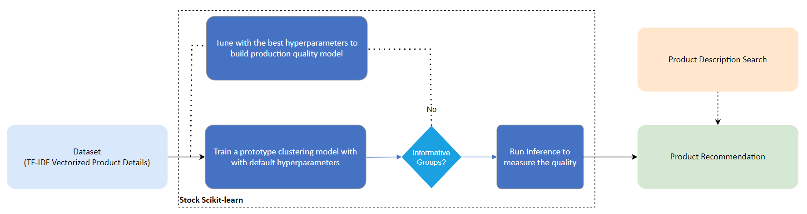
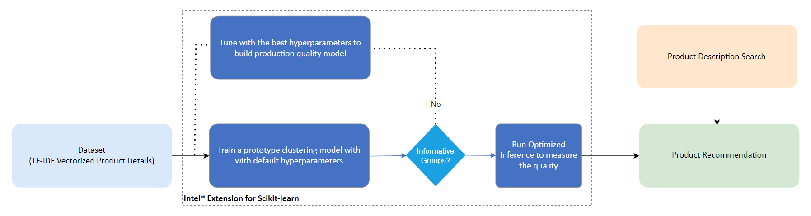
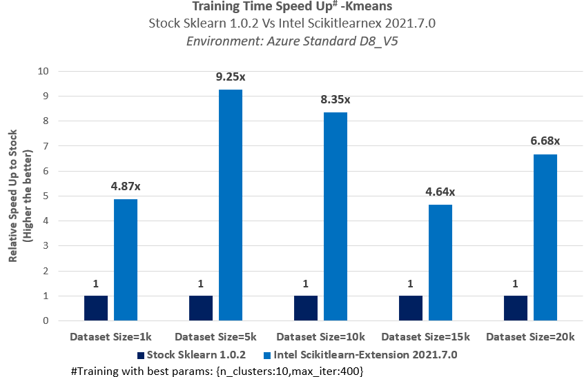
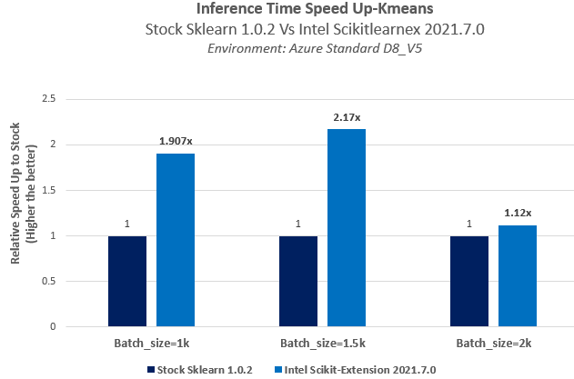

# **Scikit-Learn Product Recommendation System**

## **Table of Contents**
 - [Purpose](#purpose)
 - [Reference Solution](#reference-solution)
 - [Reference Implementation](#reference-implementation)
 - [Intel® Implementation](#optimizing-the-E2E-solution-with-Intel®-oneAPI)
 - [Performance Observations](#Performance-observations)

## **Purpose**

In this reference kit, we demonstrate one way in which we can use AI to design a Product Recommendation System for an e-commerce business. When a new customer without any previous purchase history visits the e-commerce website for the first time and a business without any user-item purchase history, a product recommendation system will recommend the products based on the textual clustering analysis on the text given in the product description. Once, the customer makes a purchase, the product recommendation system updates and recommends other products based on the purchase history and ratings provided by other users on the website. Considering the journey of a new customer from the time the customer lands on the e-commerce website for the first time to when it makes repeat purchases, this reference kit can help e-commerce businesses to bring targeted products to customers using textual clustering analysis on the text given in the product description.

## **Reference Solution**
The experiment aimed to build a Product Recommendation System for the customers, in a scenario of a business without any user-item purchase history using an unsupervised learning algorithm. The goal is to train a clustering model (textual clustering analysis given in the product description). The algorithm used for clustering is KMeans which allows creating product clustering and provides product recommendations from that cluster. We also focus on the below critical factors :
- Faster model development
- Performance efficient model inference and deployment mechanism.

<!-- Algorithm -->
The customer recommendation system has been built to recommend products based on textual clustering analysis of the text given in the product description.
Kmeans clustering is an unsupervised learning algorithm, which groups the unlabelled dataset into different clusters. Kmeans aptly fits the Product Recommendation system in this specific case where we don't have prior user history and the only data available is the product description.
For the unsupervised clustering model, the product description dataset, which is text-based, has been converted to a sparse matrix using TF-IDF Vectorizer. In this stage, the feature of text type has been changed to numerical type for further analysis and prediction.

### Key Implementation Details
The reference kit implementation is a reference solution to the described use case that includes 
  1. A reference E2E architecture to arrive at an AI solution with KMeans from Scikit-learn
  2. An Optimized reference E2E architecture enabled with Intel® Extension for Scikit-learn* available as part of Intel® oneAPI AI toolkit optimizations 

## **Reference Implementation**
### **Use Case E2E flow**


### Expected Input-Output
**Input**                                 | **Output** |
| :---: | :---: |
| Product Name        | List of product recommendations which is falling under the predicted cluster |

**Example Input**                                 | **Example Output** |
| :---: | :---: |
|water | shower,water,faucet,valve,handle,easy,brass,drain,pressure,design |

### ***Hyper-parameter Analysis***
In realistic scenarios, an analyst will run the same clustering algorithm multiple times on the same dataset, scanning across different hyper-parameters.  To capture this, we measure the total amount of time it takes to generate clustering results (Silhouette score calculation) in a loop hyper-parameters for a fixed algorithm, which we define as hyper-parameter analysis.  In practice, the results of each hyper-parameter analysis provides the analyst with many different clusters that they can take and further analyze.

### ***Dataset***
This reference kits is implemented to demonstrate on an experiment dataset. The dataset used for this demo has the description column which is used as the feature for training and can be found in the section 'Setting Up the Data' .
> **Please see this data set's applicable license for terms and conditions. Intel Corporation does not own the rights to this data set and does not confer any rights to it.**

### ***Software Requirements***
1. Python
2. Scikit-learn

> Note that this reference kit implementation already provides the necessary scripts to setup the software requirements. To utilize these environment scripts, first install Anaconda/Miniconda by following the instructions at the following link https://docs.conda.io/projects/conda/en/latest/user-guide/install/index.html

### ***Repository Clone***
Clone the Product Recommendation repository & navigate to the cloned product-recommendations-folder :
```sh
git clone https://github.com/oneapi-src/product-recommendations
cd <product-recommendations-folder> 
```

### ***Setting Up the Data***

A kaggle account is necessary to use the kaggle CLI.  Instructions can be found at https://github.com/Kaggle/kaggle-api. 

To setup the data for benchmarking under these requirements, run the following set of commands:  

> Please see this data set's applicable license for terms and conditions. Intel Corporation does not own the rights to this data set and does not confer any rights to it.

```shell
cd data
kaggle datasets download -d PromptCloudHQ/flipkart-products
unzip flipkart-products.zip -d flipkart-products-ecommerce
cp /data/flipkart-products-ecommerce/flipkart_com-ecommerce_sample.csv ./data
cd ..
```
The train-test split is 70:30.


### ***Solution setup***
The environment can be created by running the below command:
```sh
conda env create -f env/stock/product-recommendation-stock.yml
```

**YAML file**                                 | **Environment Name** |  **Configuration** |
| :---: | :---: | :---: |
| `env/stock/product-recommendation-stock.yml`             | `product-recommendation-stock` | Python=3.9.x with stock scikit-learn

For the workload implementation to arrive at first level solution we will be using the stock environment.

### ***Solution implementation***
#### **Model building process**
As mentioned above, this Product recommendation system uses KMeans from the scikit-learn library to train an AI model and generate cluster labels for the passed-in data. This process is captured within the `run_benchmarks.py` script. This script *reads and preprocesses the data*, and *performs training ,predictions and hyperparameter tuning analysis on KMeans*, while also reporting on the execution time for all the mentioned steps(we will use this information later when we are optimizing the implementation for Intel® architecture).  Furthermore, this script can also save each of the intermediate models/cluster labels for an in-depth analysis of the quality of fit.  

Lets first activate the 'product-recommendation-stock' enviroment:
```sh
conda activate product-recommendation-stock
```

Create a folder called 'saved_models' to save the trained models before the training script is run:
```sh
mkdir saved_models
```


The script `run_benchmarks.py` takes the following arguments:
```sh
usage: src/run_benchmarks.py [-d DATASET][-l LOGFILE][-i INTEL][-t TUNNING][-mp MODELPATH]

optional arguments:
  -d DATASET, --dataset DATASET
                        Dataset size will be initialized
  -t TUNNING, --tunning HYPERPARAMS
                        Hyperparameter tuning will be enabled
  -i INTEL, --intel INTEL
                        use intel accelerated technologies where available
  -mp MODELPATH --modelpath MODELPATH
                         model path for inference
```                   


As an example of using this, we can run the following command to train and save 'K-Means' models.
```sh
python src/run_benchmarks.py -d 1000 
```
We are training with 1k datasize here. Similarly, one can try with 5k, 10k, 15k & 20k.

#### Training Output:
```
Top terms per cluster:
Cluster 0:
 cabinet
 vanity
 finish
 storage
 design
 easy
 wood
 faucet
 hardware
 sink
INFO:root:Kmeans_training_time_without_Hyperparametertunning:0.3655097484588623
Saving model..........
```
In a realistic pipeline, this training process would follow the above `Use Case E2E flow` diagram, adding a human in the loop to determine the quality of the clustering solution from each of the saved models/predictions in the `saved_models` directory, or better, while tuning the model.  The quality of a clustering solution is highly dependent on the human analyst and they have the ability to not only tune hyper-parameters, but also modify the features being used to find better solutions.

#### **Running Cluster Analysis/Predictions**
To run the batch and real time inference with stock ,we would run (after creating the appropriate environment as above):

```shell
python src/run_benchmarks.py -d 1000 -mp "saved_models/prod_rec.joblib"
```
Here we have tried inference with the trained model for batchsize of 1k. Similarly one can try with other sizes like 1.5k & 2k.

Inference output
```
Recommendations for :  water
Cluster 4:
 shower
 water
 faucet
 valve
 handle
 easy
 brass
 drain
 pressure
 design

```

**Hyperparameter tuning**

***Loop Based Hyperparameter Tuning***
It is used to apply fit method to train and optimize by applying different parameter values in loops to get the best Sihoutte score and thereby a better performing model.

**Parameters Considered**
| **Parameter** | **Description** | **Values**
| :-- | :-- | :-- 
| `n_clusters` | Number of clusters | 5, 10, 15, 20
| `max_iter` | Max iteration value | 400, 450, 500, 550

To run Hyperparameter tuning with stock python and stock technologies, we would run (after creating the appropriate environment as above):
```shell
python src/run_benchmarks.py -d 1000 -t 1 
```
We are training with 1k datasize here. Similarly, one can try with 5k, 10k, 15k & 20k also.

## **Optimizing the E2E solution with Intel® oneAPI**

Although AI delivers a solution to address Product recommendation, on a production scale implementation with millions or billions of records demands for more compute power without leaving any performance on the table.In order to derive the most insightful and beneficial actions to take, business analyst will need to study and analyze the clusters generated though various feature sets and algorithms, thus requiring frequent re-runs of the algorithms under many different parameter sets. To utilize all the hardware resources efficiently, Software optimizations cannot be ignored.   
 
This reference kit solution extends to demonstrate the advantages of using the Intel® oneAPI AI Analytics Toolkit on the task of building a product recommendation system from product descriptions via cluster analysis.  The savings gained from using Intel® technologies can lead an analyst to more efficiently explore and understand customer archetypes, leading to better and more precise targeted solutions.

### ***Optimized E2E architecture with Intel® oneAPI components***




### **Optimized software components**

#### ***Intel® Extension for SciKit-learn****

Intel Extension for Scikit-learn uses the Intel® oneAPI Data Analytics Library (oneDAL) to achieve its acceleration. This library enables all the latest vector instructions, such as the Intel Advanced Vector Extensions (Intel AVX-512). It also uses cache-friendly data blocking, fast BLAS operations with the Intel® oneAPI Math Kernel Library (oneMKL), and scalable multithreading with the Intel® oneAPI Threading Building Blocks (oneTBB).

### **Optimized Solution setup**

Follow the below conda installation commands to setup the Intel enviroment along with the necessary packages for this model training and prediction.. 
```sh
conda env create -f env/intel/product-recommendation-intel.yml
```

**Activate conda environment for intel version**

Use the following command to activate the environment that was created:

```sh
conda activate product-recommendation-intel
```
This script utilizes the dependencies found in the `env/intel/product-recommendation-intel.yml` file to create an environment as follows:

**YAML file**                                 | **Environment Name** |  **Configuration** |
| :---: | :---: | :---: |
`env/intel/product-recommendation-intel.yml`             | `product-recommendation-intel` | Python=3.9.x with Intel® Extension for Scikit-learn*  |


### ***Optimized Solution implementation***

Optimizing the KMeans solution with Intel® oneAPI is as simple as adding the following lines of code prior to calling the sklearn algorithms:

```python
from sklearnex import patch_sklearn
patch_sklearn()
```

#### **Model building process with Intel® optimizations**

The run_benchmarks.py script is run by adding the `--intel` flag when running the training to enable the Intel flag.  The same training process can be run, optimized with Intel® oneAPI as the sample code below .To run Training with Intel® python and Intel® technologies for dataset, we would run (after creating the appropriate environment as above):
```shell
conda activate product-recommendation-intel
python src/run_benchmarks.py -d 1000 -i 1
```
We are training with 1k datasize here. Similarly, one can try with 5k, 10k, 15k & 20k.

#### Training Output
```
Intel(R) Extension for Scikit-learn* enabled (https://github.com/intel/scikit-learn-intelex)
DEBUG:root:(100000, 2)
DEBUG:root:(100000, 10)
INFO:root:Data preparation time:9.813132762908936
Top terms per cluster:
Cluster 0:
 cabinet
 vanity
 finish
 storage
 design
 easy
 faucet
 hardware
 wood
 sink
INFO:root:Kmeans_training_time_without_Hyperparametertunning:0.16348862648010254
Saving model..........
```
To run the batch and real time inference with Intel enviroment,we would run (after creating the appropriate environment as above):
```shell
python src/run_benchmarks.py -d 1000 -i 1 -mp "saved_models/prod_rec.joblib"
```
Here we have shown for 1k batchsize. Similarly , the inference can tried with 1.5k & 2k sizes as well.

#### Inference Output 
```
Recommendations for :  water
Cluster 1:
 water
 shower
 faucet
 valve
 easy
 handle
 brass
 pvc
 pressure
 drain

```
**Hyperparameter tuning**

***Loop Based Hyperparameter Tuning***
It is used to apply fit method to train and optimize by applying different parameter values in loops to get the best Silhouette score and thereby a better performing model.

**Parameters Considered**
| **Parameter** | **Description** | **Values**
| :-- | :-- | :-- 
| `n_clusters` | Number of clusters | 5, 10, 15, 20
| `max_iter` | Max iteration value | 400, 450, 500, 550

To run Hyperparameter tuning with intel python and Intel technologies, we would run (after creating the appropriate environment as above):
```shell
python src/run_benchmarks.py -d 1000 -i 1 -t 1 
```
### **Performance Observations**

We investigate the amount of time taken to perform hyper-parameter analysis under a combination of max_iter(400,450,500,550) and number of clusters(5,10,15,20) and on different dataset sizes.

As clustering analysis is an exploratory task, an analyst will often run on different dataset of different sizes, resulting in different insights that they may use for decisions all from the same raw dataset.

For demonstrational purposes of the scaling of Intel® Extension for Scikit-learn*, we benchmark a full cluster analysis on different dataset sizes.

We summarize the benchmarking results comparing the Intel® technologies vs the stock alternative on the following tasks:
  
  1. Training with best hyperparameters
  2. Inference using the saved model

### ***Training***<br>

<br>**Key Takeaways**<br>Intel® Extension for Scikit-learn* 2021.7.0 for the KMeans model offers training time speed-up up to **9.25x** compared to stock Scikit-learn 1.0.2 with the best fit parameters on 5k dataset. 

### ***Inference***<br>

<br>**Key Takeaways**<br>Intel® Extension for Scikit-learn* 2021.7.0 for the KMeans model offers inference time speed-up up to **2.17x** compared to stock Scikit-learn 1.0.2 with 1.5k batch size. 

### Conclusion
To build a Product Recommendation System, Data Scientist will need to train models for substantial datasets and run inference more frequently. The ability to accelerate training will allow them to train more frequently and achieve better accuracy. Besides training, faster speed in inference will allow them to provide product recommendations in real-time scenarios as well as more frequently. This reference kit implementation provides performance-optimized guide around Product Recommendation System use cases that can be easily scaled across similar use cases.

### Notices & Disclaimers
Performance varies by use, configuration and other factors. Learn more on the [Performance Index site](https://edc.intel.com/content/www/us/en/products/performance/benchmarks/overview/). Performance results are based on testing as of dates shown in configurations and may not reflect all publicly available updates.  See backup for configuration details.  No product or component can be absolutely secure. Your costs and results may vary. Intel technologies may require enabled hardware, software or service activation.<br>© Intel Corporation.  Intel, the Intel logo, and other Intel marks are trademarks of Intel Corporation or its subsidiaries.  Other names and brands may be claimed as the property of others.

## Appendix

**Date Testing Performed**: November 2022 

**Configuration Details and Workload Setup**: Azure D8v5 (Intel® Xeon® Platinum 8370C CPU @ 2.80GHz), 1 Socket, 4 Cores per Socket, 2 Threads per Core, Turbo: On, Total Memory: 32 GB, OS: Ubuntu 20.04, Kernel: Linux 5.15.0-1019-azure. Framework/Toolkit: Intel® oneAPI Extension for Scikit, Python -v3.9.13. Dataset size: 20000 product details and 15 features. Model: KMeans Clustering. Batch size for prediction time benchmark: 30% of train data size. Precision: FP32. 

**Testing performed by** Intel Corporation

### **Experiment setup**

| Platform                          | Microsoft Azure:Standard_D8_v5 (Ice Lake)<br>Ubuntu 20.04
| :---                              | :---
| Hardware                          | Intel IceLake CPU
| Software                          | Intel® oneAPI AI Analytics Toolkit, scikit-learn, pandas
| What you will learn               | Advantage of using components in Intel® oneAPI AI Analytics Toolkit over the stock version for the scikit-learn framework based model build, tuning and inferencing.
